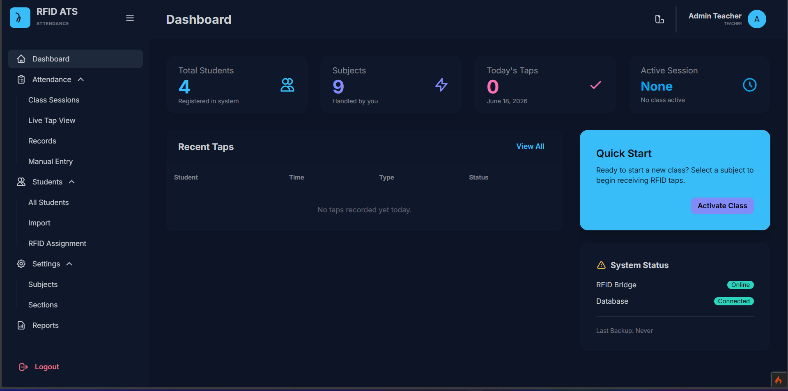
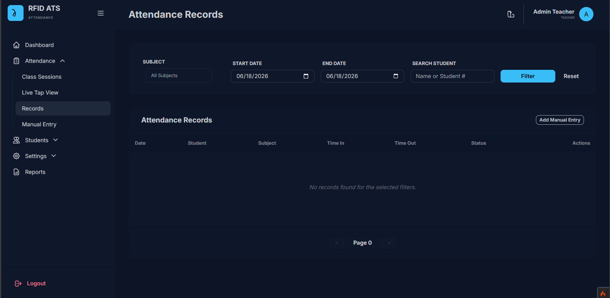
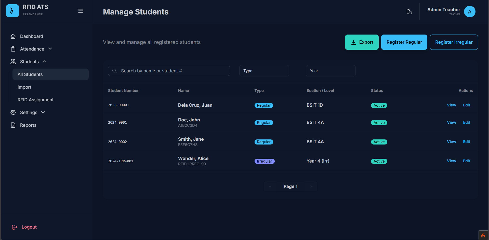
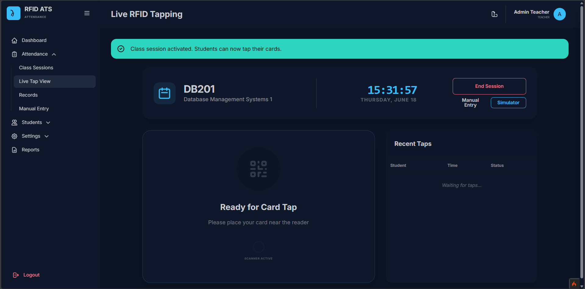

# 🏫 RFID Attendance Tracking System (ATS)

> A modern, fast, and reliable web-based attendance tracking solution powered by CodeIgniter 4 and RFID technology.


## 📑 Table of Contents

- [Overview](#-overview)
- [Key Features](#-key-features)
- [Tech Stack](#-tech-stack)
- [Screenshots](#-screenshots)
- [Getting Started](#-getting-started)
- [Usage](#-usage)
- [Project Structure](#-project-structure)
- [Academic Context](#-academic-context)
- [Contributing](#-contributing)
- [Contact](#-contact)

## 📖 Overview

The RFID Attendance Tracking System simplifies the monitoring of student attendance through automated RFID scanning. It eliminates manual roll-calls and provides educators with real-time class session monitoring, precise records, and detailed reporting capabilities. 

## ✨ Key Features

- **📡 Live RFID Tap View**: Real-time interface for capturing student RFID taps as they enter the room.
- **👨‍🎓 Student Management**: Add, view, and manage student details, including bulk data imports.
- **🏷️ RFID Assignment**: Easily map and assign unique RFID tags to enrolled students.
- **📅 Class Sessions & Settings**: Configure subjects, sections, and track discrete class sessions.
- **📝 Manual Entry**: Override or manually log attendance records when a student forgets their ID.
- **📊 Reporting**: Generate exportable attendance reports (PDF/Excel support integrated via dompdf and phpspreadsheet).
- **🎨 Dynamic Themes**: Toggle between 15+ modern UI themes powered by DaisyUI.

## 🛠️ Tech Stack

**Backend:**
- PHP ^8.2
- CodeIgniter ^4.7 Framework
- MySQL / MariaDB

**Frontend:**
- Tailwind CSS (via CDN)
- DaisyUI (via CDN)
- Tom Select (Searchable Dropdowns)
- Inter Font (Google Fonts)

**Libraries/Dependencies:**
- `dompdf/dompdf` (PDF Generation)
- `phpoffice/phpspreadsheet` (Excel Export/Import)

## 📸 Screenshots

<!-- [TODO: Replace these placeholder images with actual screenshots of your application] -->
**Dashboard Page**
<br>

<br>
**Attendance Records Page**
<br>

<br>
**Student Management Page**
<br>

<br>
**Live Tap View Page**
<br>


## 🚀 Getting Started

Follow these steps to set up the project locally.

### Prerequisites

- PHP 8.2 or higher
- Composer
- MySQL/MariaDB Server
- Web Server (Apache/Nginx) or PHP Built-in Server

### Installation

1. **Clone the repository**
   ```bash
   git clone https://github.com/PinkyBun/RFID-Attendance-Tracking-System.git
   cd RFID-Attendance-Tracking-System
   ```

2. **Install Composer Dependencies**
   ```bash
   composer install
   ```

3. **Configure the Environment**
   - Copy the `.env` file (if `env` exists, duplicate it and rename it to `.env`).
   ```bash
   cp env .env
   ```
   - Open `.env` and configure your database settings:
   ```env
   database.default.hostname = localhost
   database.default.database = ats_database
   database.default.username = root
   database.default.password =
   database.default.DBDriver = MySQLi
   ```
   - Ensure the `CI_ENVIRONMENT` is set to `development` for local testing.

4. **Run Database Migrations and Seeders**
   ```bash
   php spark migrate
   php spark db:seed AdminSeeder
   ```
   *(Note: Ensure your database exists before running migrations)*

5. **Start the Development Server**
   ```bash
   php spark serve
   ```
   The application will now be running at `http://localhost:8080`.

## 💻 Usage

1. Open your browser and navigate to `http://localhost:8080`.
2. Login using the default administrator credentials (configured via `AdminSeeder`).
3. Navigate to **Settings > Subjects & Sections** to configure your foundational data.
4. Go to **Students > Import** to bulk upload your student roster.
5. Head to **Students > RFID Assignment** to bind physical RFID tags to students.
6. Open **Attendance > Live Tap View** and begin scanning RFID cards!

## 📂 Project Structure

```text
├── app/                  # Core application code (Controllers, Models, Views)
│   ├── Controllers/      # Handles incoming HTTP requests
│   ├── Models/           # Database interactions and business logic
│   └── Views/            # UI templates and layouts
├── public/               # Publicly accessible folder (index.php, CSS, JS)
├── spark                 # CodeIgniter command-line utility
├── tests/                # PHPUnit test files
├── vendor/               # Composer dependencies
└── writable/             # Directories writable by the web server (logs, cache, uploads)
```

## 🎓 Academic Context

This project was developed as part of a university course requirement, specifically for **Systems Integration and Architecture 2 (SIA2)**. It serves as a practical implementation of system design, database management, and hardware integration (RFID) within a modern web framework.

**Team / Contributors:**
- [TODO: Add Team Member 1 Name & Role]
- [TODO: Add Team Member 2 Name & Role]
- [TODO: Add Team Member 3 Name & Role]

## 🤝 Contributing

Contributions are welcome! If you would like to improve this project:

1. Fork the repository
2. Create your feature branch (`git checkout -b feature/AmazingFeature`)
3. Commit your changes (`git commit -m 'Add some AmazingFeature'`)
4. Push to the branch (`git push origin feature/AmazingFeature`)
5. Open a Pull Request

## 📫 Contact

**Author:** Jasmine N.
**GitHub:** [@PinkyBun](https://github.com/PinkyBun)  
**Project Link:** [https://github.com/PinkyBun/ATS](https://github.com/PinkyBun/ATS)
