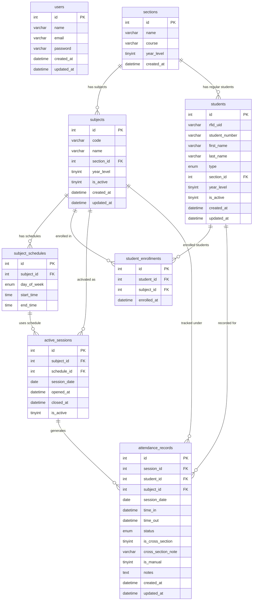

# RFID-Based Attendance System — System Blueprint
> **Project Stack:** CodeIgniter 4 · MySQL (XAMPP) · Single-teacher admin  
> **Status:** Pre-coding blueprint — awaiting approval before implementation

---

## Table of Contents

1. [Database Schema](#1-database-schema)
2. [Entity Relationship Diagram (ERD)](#2-entity-relationship-diagram-erd)
3. [CodeIgniter 4 Folder Structure](#3-codeigniter-4-folder-structure)
4. [Data Flow — RFID Tap to Database Record](#4-data-flow--rfid-tap-to-database-record)
5. [Business Logic Rules](#5-business-logic-rules)
6. [Controllers, Models, and Views Inventory](#6-controllers-models-and-views-inventory)

---

## 1. Database Schema

### Overview of Tables

| # | Table Name             | Purpose                                                   |
|---|------------------------|-----------------------------------------------------------|
| 1 | `users`                | Admin/teacher account (single user)                       |
| 2 | `sections`             | Named sections (e.g., BSIT 2A)                            |
| 3 | `subjects`             | Teacher-defined subjects                                  |
| 4 | `subject_schedules`    | Days and times assigned to each subject                   |
| 5 | `students`             | All registered students (regular and irregular)           |
| 6 | `student_enrollments`  | Subjects each student is enrolled in                      |
| 7 | `active_sessions`      | Currently selected subject/class for RFID tapping         |
| 8 | `attendance_records`   | One record per student per session (time in, time out, status) |

---

### Table 1: `users`

Stores the single admin/teacher account.

| Column         | Data Type       | Constraints            | Description                         |
|----------------|-----------------|------------------------|-------------------------------------|
| `id`           | INT UNSIGNED    | PK, AUTO_INCREMENT     | Primary key                         |
| `name`         | VARCHAR(100)    | NOT NULL               | Full name of the teacher            |
| `email`        | VARCHAR(150)    | NOT NULL, UNIQUE       | Login email                         |
| `password`     | VARCHAR(255)    | NOT NULL               | Hashed password (bcrypt)            |
| `created_at`   | DATETIME        | NOT NULL               | Account creation timestamp          |
| `updated_at`   | DATETIME        | NOT NULL               | Last update timestamp               |

> **Notes:** Only one row will ever exist. No role column needed — this is always the admin.

---

### Table 2: `sections`

Named sections that regular students belong to.

| Column         | Data Type       | Constraints            | Description                         |
|----------------|-----------------|------------------------|-------------------------------------|
| `id`           | INT UNSIGNED    | PK, AUTO_INCREMENT     | Primary key                         |
| `name`         | VARCHAR(50)     | NOT NULL, UNIQUE       | Section name (e.g., BSIT 2A)        |
| `course`       | VARCHAR(100)    | NOT NULL               | Course/program (e.g., BSIT)         |
| `year_level`   | TINYINT UNSIGNED| NOT NULL               | Year level (1 to 4)                 |
| `created_at`   | DATETIME        | NOT NULL               | Record creation timestamp           |

> **Notes:** Irregular students are NOT assigned to a section in this table — they declare year level independently.

---

### Table 3: `subjects`

Teacher-defined subjects across all year levels and sections.

| Column         | Data Type       | Constraints            | Description                                     |
|----------------|-----------------|------------------------|-------------------------------------------------|
| `id`           | INT UNSIGNED    | PK, AUTO_INCREMENT     | Primary key                                     |
| `code`         | VARCHAR(20)     | NOT NULL               | Subject code (e.g., IT301)                      |
| `name`         | VARCHAR(150)    | NOT NULL               | Full subject name                               |
| `section_id`   | INT UNSIGNED    | FK → sections.id, NULL | Owning section (NULL for irregular-only subjects)|
| `year_level`   | TINYINT UNSIGNED| NOT NULL               | Target year level of this subject               |
| `is_active`    | TINYINT(1)      | NOT NULL, DEFAULT 1    | Whether this subject is currently offered       |
| `created_at`   | DATETIME        | NOT NULL               | Record creation timestamp                       |
| `updated_at`   | DATETIME        | NOT NULL               | Last update timestamp                           |

> **Foreign Keys:**  
> - `section_id` → `sections.id` ON DELETE SET NULL

---

### Table 4: `subject_schedules`

Stores the recurring weekly schedule for each subject. A subject can have multiple schedule rows (e.g., Mon/Wed/Fri).

| Column         | Data Type       | Constraints            | Description                                     |
|----------------|-----------------|------------------------|-------------------------------------------------|
| `id`           | INT UNSIGNED    | PK, AUTO_INCREMENT     | Primary key                                     |
| `subject_id`   | INT UNSIGNED    | FK → subjects.id       | The subject this schedule belongs to            |
| `day_of_week`  | ENUM('Mon','Tue','Wed','Thu','Fri','Sat') | NOT NULL | Day class meets   |
| `start_time`   | TIME            | NOT NULL               | Official class start time                       |
| `end_time`     | TIME            | NOT NULL               | Official class end time                         |

> **Foreign Keys:**  
> - `subject_id` → `subjects.id` ON DELETE CASCADE

---

### Table 5: `students`

All registered students regardless of type.

| Column           | Data Type       | Constraints            | Description                                           |
|------------------|-----------------|------------------------|-------------------------------------------------------|
| `id`             | INT UNSIGNED    | PK, AUTO_INCREMENT     | Primary key                                           |
| `rfid_uid`       | VARCHAR(50)     | NOT NULL, UNIQUE       | Unique RFID card UID                                  |
| `student_number` | VARCHAR(30)     | NOT NULL, UNIQUE       | School-issued student number                          |
| `first_name`     | VARCHAR(80)     | NOT NULL               | First name                                            |
| `last_name`      | VARCHAR(80)     | NOT NULL               | Last name                                             |
| `type`           | ENUM('regular','irregular') | NOT NULL  | Student classification                                |
| `section_id`     | INT UNSIGNED    | FK → sections.id, NULL | Section assignment (regular students only; NULL for irregular) |
| `year_level`     | TINYINT UNSIGNED| NOT NULL               | Year level (self-declared for irregular students)     |
| `is_active`      | TINYINT(1)      | NOT NULL, DEFAULT 1    | Whether the student is currently enrolled in the school|
| `created_at`     | DATETIME        | NOT NULL               | Registration timestamp                                |
| `updated_at`     | DATETIME        | NOT NULL               | Last update timestamp                                 |

> **Foreign Keys:**  
> - `section_id` → `sections.id` ON DELETE SET NULL  
> **Constraint:** If `type = 'regular'`, `section_id` MUST NOT be NULL (enforced at app level).  
> If `type = 'irregular'`, `section_id` MUST be NULL.

---

### Table 6: `student_enrollments`

Maps which students are enrolled in which subjects.

| Column         | Data Type       | Constraints                          | Description                                      |
|----------------|-----------------|--------------------------------------|--------------------------------------------------|
| `id`           | INT UNSIGNED    | PK, AUTO_INCREMENT                   | Primary key                                      |
| `student_id`   | INT UNSIGNED    | FK → students.id                     | The enrolled student                             |
| `subject_id`   | INT UNSIGNED    | FK → subjects.id                     | The subject enrolled in                          |
| `enrolled_at`  | DATETIME        | NOT NULL                             | When enrollment was created                      |

> **Unique Constraint:** (`student_id`, `subject_id`) — a student cannot be enrolled twice in the same subject.  
> **Foreign Keys:**  
> - `student_id` → `students.id` ON DELETE CASCADE  
> - `subject_id` → `subjects.id` ON DELETE CASCADE  
> **Notes:**  
> - Regular students are bulk-enrolled when registered (all subjects tied to their section are auto-added).  
> - Irregular students self-enroll per subject during registration.

---

### Table 7: `active_sessions`

Tracks which subject the teacher has currently activated for RFID tapping. Only one row should be active at a time.

| Column             | Data Type       | Constraints                | Description                                        |
|--------------------|-----------------|----------------------------|----------------------------------------------------|
| `id`               | INT UNSIGNED    | PK, AUTO_INCREMENT         | Primary key                                        |
| `subject_id`       | INT UNSIGNED    | FK → subjects.id           | The subject selected for tapping                   |
| `schedule_id`      | INT UNSIGNED    | FK → subject_schedules.id  | Which specific schedule slot is active             |
| `session_date`     | DATE            | NOT NULL                   | The calendar date of this session                  |
| `opened_at`        | DATETIME        | NOT NULL                   | When the teacher activated this session            |
| `closed_at`        | DATETIME        | NULL                       | When the teacher closed/ended the session (NULL = still open) |
| `is_active`        | TINYINT(1)      | NOT NULL, DEFAULT 1        | Quick flag; set to 0 on close                      |

> **Foreign Keys:**  
> - `subject_id` → `subjects.id`  
> - `schedule_id` → `subject_schedules.id`  
> **Rule:** When the teacher opens a new session, any previously active session for the same subject+date is automatically closed.

---

### Table 8: `attendance_records`

One row per student per session — the core attendance log.

| Column              | Data Type       | Constraints                       | Description                                                     |
|---------------------|-----------------|-----------------------------------|-----------------------------------------------------------------|
| `id`                | INT UNSIGNED    | PK, AUTO_INCREMENT                | Primary key                                                     |
| `session_id`        | INT UNSIGNED    | FK → active_sessions.id           | Which session this record belongs to                            |
| `student_id`        | INT UNSIGNED    | FK → students.id                  | The attending student                                           |
| `subject_id`        | INT UNSIGNED    | FK → subjects.id                  | The subject (denormalized for fast querying)                    |
| `session_date`      | DATE            | NOT NULL                          | Date of attendance (denormalized for fast querying)             |
| `time_in`           | DATETIME        | NULL                              | Timestamp of RFID tap-in (or manually entered time)             |
| `time_out`          | DATETIME        | NULL                              | Timestamp of RFID tap-out (or manually entered time)            |
| `status`            | ENUM('on_time','late','incomplete','absent','manual') | NOT NULL | Attendance status               |
| `is_cross_section`  | TINYINT(1)      | NOT NULL, DEFAULT 0               | 1 if the student tapped in a class outside their assigned section |
| `cross_section_note`| VARCHAR(255)    | NULL                              | Human-readable note if flagged (e.g., "Tapped in BSIT 2B; enrolled in BSIT 2A") |
| `is_manual`         | TINYINT(1)      | NOT NULL, DEFAULT 0               | 1 if this record was created or edited manually by the teacher  |
| `notes`             | TEXT            | NULL                              | Optional teacher notes                                          |
| `created_at`        | DATETIME        | NOT NULL                          | When the record was first created                               |
| `updated_at`        | DATETIME        | NOT NULL                          | Last modification timestamp                                     |

> **Unique Constraint:** (`session_id`, `student_id`) — one record per student per session.  
> **Foreign Keys:**  
> - `session_id` → `active_sessions.id`  
> - `student_id` → `students.id`  
> - `subject_id` → `subjects.id`

---

## 2. Entity Relationship Diagram (ERD)



### Relationship Descriptions

| Relationship                          | Type       | Explanation                                                                                              |
|---------------------------------------|------------|----------------------------------------------------------------------------------------------------------|
| `sections` → `subjects`               | One-to-Many | A section owns multiple subjects. Subjects may also exist without a section (for irregular-only access). |
| `sections` → `students`               | One-to-Many | A section has many regular students. Irregular students have no section.                                 |
| `subjects` → `subject_schedules`      | One-to-Many | A subject can meet multiple times a week (e.g., MWF), each as a separate schedule row.                  |
| `students` ↔ `subjects`              | Many-to-Many| Managed via `student_enrollments`. One student can take many subjects; one subject has many students.    |
| `subjects` → `active_sessions`        | One-to-Many | The teacher can open the same subject multiple times (once per class meeting date).                      |
| `subject_schedules` → `active_sessions`| One-to-Many| Each active session is tied to a specific recurring schedule slot.                                       |
| `active_sessions` → `attendance_records`| One-to-Many| One session produces one attendance record per tapping student.                                         |
| `students` → `attendance_records`     | One-to-Many | One student accumulates many attendance records over time.                                               |
| `subjects` → `attendance_records`     | One-to-Many | Denormalized FK for efficient subject-level attendance reports.                                          |

---

## 3. CodeIgniter 4 Folder Structure

```
d:\SIA2\ATS\
│
├── app/
│   ├── Config/
│   │   ├── App.php                     # Base URL and app-wide config
│   │   ├── Auth.php                    # Custom auth config (session lifetime, etc.)
│   │   ├── Database.php                # MySQL XAMPP connection settings
│   │   └── Routes.php                  # All named routes for the application
│   │
│   ├── Controllers/
│   │   ├── Auth/
│   │   │   └── AuthController.php      # Login, logout for the teacher/admin
│   │   ├── Dashboard/
│   │   │   └── DashboardController.php # Summary stats, quick overview
│   │   ├── Students/
│   │   │   └── StudentController.php   # CRUD for regular and irregular students
│   │   ├── Subjects/
│   │   │   └── SubjectController.php   # CRUD for subjects and schedule assignment
│   │   ├── Sections/
│   │   │   └── SectionController.php   # CRUD for sections
│   │   ├── Attendance/
│   │   │   ├── SessionController.php   # Open/close active sessions, select active class
│   │   │   ├── RfidController.php      # Receives RFID tap (API endpoint), processes logic
│   │   │   └── AttendanceController.php# Manual attendance entry; view/edit records
│   │   └── Reports/
│   │       └── ReportController.php    # Attendance reports per subject/date/student
│   │
│   ├── Models/
│   │   ├── UserModel.php               # Admin user queries
│   │   ├── SectionModel.php            # Section CRUD queries
│   │   ├── SubjectModel.php            # Subject CRUD queries
│   │   ├── SubjectScheduleModel.php    # Schedule CRUD queries
│   │   ├── StudentModel.php            # Student CRUD queries; lookup by RFID UID
│   │   ├── StudentEnrollmentModel.php  # Enrollment CRUD; bulk-enroll regular students
│   │   ├── ActiveSessionModel.php      # Open/close session queries; find current active session
│   │   └── AttendanceRecordModel.php   # Create/update records; cross-section detection; report queries
│   │
│   ├── Views/
│   │   ├── layouts/
│   │   │   ├── main.php                # Main admin layout (sidebar, topbar, scripts)
│   │   │   └── auth.php                # Minimal layout for login page
│   │   ├── auth/
│   │   │   └── login.php               # Teacher login form
│   │   ├── dashboard/
│   │   │   └── index.php               # Dashboard: today's sessions, recent taps, summary cards
│   │   ├── sections/
│   │   │   ├── index.php               # List all sections
│   │   │   ├── create.php              # Create section form
│   │   │   └── edit.php                # Edit section form
│   │   ├── subjects/
│   │   │   ├── index.php               # List all subjects with schedules
│   │   │   ├── create.php              # Create subject + add schedule slots
│   │   │   └── edit.php                # Edit subject details and schedules
│   │   ├── students/
│   │   │   ├── index.php               # List all students with type badge and section
│   │   │   ├── create_regular.php      # Register a regular student (select section, auto-enroll)
│   │   │   ├── create_irregular.php    # Register an irregular student (select subjects manually)
│   │   │   ├── edit.php                # Edit student details
│   │   │   └── show.php                # Student profile with enrollment and attendance history
│   │   ├── attendance/
│   │   │   ├── session_select.php      # Teacher selects/activates a subject for today's class
│   │   │   ├── rfid_tap.php            # Live RFID tap screen — shows active class and recent taps in real time
│   │   │   ├── manual_entry.php        # Manual attendance entry form
│   │   │   └── records.php             # View and edit attendance records (filterable by subject/date)
│   │   └── reports/
│   │       ├── index.php               # Report filters UI (subject, date range, student, status)
│   │       └── view.php                # Rendered report table with export options
│   │
│   ├── Filters/
│   │   └── AuthFilter.php              # Protects all routes except /login; redirects to login if unauthenticated
│   │
│   ├── Helpers/
│   │   └── attendance_helper.php       # Shared functions: compute status, format time, cross-section check
│   │
│   ├── Libraries/
│   │   └── RfidProcessor.php           # Encapsulates the full tap processing pipeline (look up → validate → record)
│   │
│   └── Database/
│       └── Migrations/
│           ├── 2024-01-01-000001_CreateUsersTable.php
│           ├── 2024-01-01-000002_CreateSectionsTable.php
│           ├── 2024-01-01-000003_CreateSubjectsTable.php
│           ├── 2024-01-01-000004_CreateSubjectSchedulesTable.php
│           ├── 2024-01-01-000005_CreateStudentsTable.php
│           ├── 2024-01-01-000006_CreateStudentEnrollmentsTable.php
│           ├── 2024-01-01-000007_CreateActiveSessionsTable.php
│           └── 2024-01-01-000008_CreateAttendanceRecordsTable.php
│
├── public/
│   ├── index.php                       # CI4 front controller (do not modify)
│   ├── css/
│   │   └── app.css                     # Admin panel styles
│   ├── js/
│   │   ├── rfid.js                     # Polls or listens for RFID tap events; updates live view
│   │   └── app.js                      # General UI scripts
│   └── assets/
│       └── logo.png                    # School/system logo
│
├── writable/
│   └── logs/                           # CI4 error and system logs
│
├── .env                                # Environment variables (DB credentials, base URL)
├── composer.json                       # PHP dependencies
└── spark                               # CI4 CLI tool
```

---

## 4. Data Flow — RFID Tap to Database Record

The following describes the complete journey of a single RFID tap from hardware to stored database record.

```
[RFID Reader Hardware]
        │
        │  (1) Card is tapped → Reader outputs UID string
        │      via USB/Serial to a local bridge script
        │      (Python or JavaScript running on the PC)
        ▼
[Local Bridge / Client-Side]
        │
        │  (2) Bridge sends HTTP POST to:
        │      POST /attendance/rfid/tap
        │      Body: { "rfid_uid": "A3F2C19D" }
        ▼
[RfidController::tap()]
        │
        │  (3) Validate request (check rfid_uid is present)
        │
        │  (4) Call RfidProcessor::process($rfid_uid)
        ▼
[RfidProcessor::process()]
        │
        │  (5) Look up student by rfid_uid in `students` table
        │      → If NOT found: return JSON error "Unknown card"
        │
        │  (6) Find the currently active session via `active_sessions`
        │      WHERE is_active = 1 (only one should exist)
        │      → If NONE found: return JSON error "No active class session"
        │
        │  (7) Check `student_enrollments`:
        │      Is this student enrolled in the active session's subject?
        │      → If NOT enrolled:
        │          Check if student section ≠ active session's section
        │          → Flag as cross-section (see Business Logic §5.3)
        │          → Still allow log, but set is_cross_section = 1
        │
        │  (8) Look up `attendance_records` WHERE
        │      session_id = active_session.id AND student_id = student.id
        │
        │  (9) BRANCH: Does a record already exist?
        │
        │      ├── NO → This is a TIME IN tap
        │      │         Compute tap time vs. schedule start_time + 15 min
        │      │         Set status = 'on_time' or 'late'
        │      │         INSERT into attendance_records:
        │      │           time_in = NOW(), status = computed, time_out = NULL
        │      │
        │      └── YES → This is a TIME OUT tap
        │                Check: time_out IS NULL?
        │                  YES → UPDATE record: time_out = NOW()
        │                        Re-evaluate final status if needed
        │                  NO  → Duplicate tap; return JSON "Already tapped out"
        ▼
[AttendanceRecordModel]
        │
        │  (10) Execute INSERT or UPDATE query
        ▼
[Database: attendance_records table]
        │
        │  (11) Return JSON response to bridge/client:
        │       { "success": true, "student_name": "...", "status": "on_time", "tap_type": "time_in" }
        ▼
[rfid_tap.php Live View]
        │
        │  (12) rfid.js polls or receives the response
        │       Updates the live tap feed table in real time
        │       Flashes a green (on time) or yellow (late) visual indicator
```

---

## 5. Business Logic Rules

### 5.1 Grace Period — On Time vs. Late

| Condition                                          | Status Assigned |
|----------------------------------------------------|-----------------|
| `time_in` ≤ `schedule.start_time + 15 minutes`    | `on_time`       |
| `time_in` > `schedule.start_time + 15 minutes`    | `late`          |

- The 15-minute window is calculated using the `start_time` from the `subject_schedules` row linked to the active session.
- This check is performed **on the server** at the moment the tap is received, using `NOW()`.
- The grace period applies **only to time in**. There is no late/on-time evaluation for time out.

---

### 5.2 Incomplete Record (Missed Time Out)

- A record is flagged `incomplete` when:
  - The session is **closed** by the teacher (active_sessions.closed_at is set), AND
  - The student's `time_out` is still `NULL`.
- The system automatically batch-updates all remaining NULL time_out records for the session to `status = 'incomplete'` when the teacher closes the session via `SessionController::close()`.
- Incomplete records are still editable manually by the teacher afterwards.

---

### 5.3 Cross-Section Handling

This rule applies when a **regular student** taps into a class whose subject belongs to a **different section** than their own.

**Detection logic:**
1. Retrieve the student's `section_id` from `students`.
2. Retrieve the active session's subject's `section_id` from `subjects` joined with `active_sessions`.
3. If `student.section_id ≠ subject.section_id` → Cross-section flag is raised.

**Actions taken:**
- `attendance_records.is_cross_section` is set to `1`.
- `attendance_records.cross_section_note` is populated with a descriptive message, e.g.:  
  `"Student tapped into BSIT 2B class. Student is enrolled in BSIT 2A."`
- The attendance is still **logged and saved** under the active session — the tap is not rejected.
- The record remains associated with the student's actual profile (`student_id`), so their proper section's report reflects the anomaly.
- The teacher can view flagged records in the attendance record list (filtered by `is_cross_section = 1`).

> **Note:** Irregular students do not trigger this flag since they have no section assignment (`section_id IS NULL`).

---

### 5.4 Manual Attendance Fallback

When the RFID reader is unavailable:

1. Teacher navigates to **Manual Attendance → New Entry** (`/attendance/manual`).
2. Teacher selects the active session (or opens one if not yet opened).
3. Teacher searches for a student by name or student number.
4. Teacher enters `time_in` and optionally `time_out` via time picker fields.
5. `status` is **computed automatically** using the same grace-period logic as RFID taps.
6. `is_manual` is set to `1` on the resulting `attendance_records` row.
7. All normal rules (cross-section, incomplete) still apply to manual entries.

**Editing existing records:**  
The teacher can also open any existing attendance record and modify `time_in`, `time_out`, or `status` manually. Edited records also have `is_manual` set to `1` and an updated `updated_at` timestamp.

---

### 5.5 Duplicate Tap Guard

| Scenario                                     | System Behavior                                      |
|----------------------------------------------|------------------------------------------------------|
| Student taps twice with no existing record   | First tap logged as time_in; second ignored (guard returns "already tapped in") |
| Student taps with time_in set, time_out NULL | Tap logged as time_out                               |
| Student taps with both time_in and time_out  | Tap rejected with "already tapped out" message       |

---

### 5.6 Student Registration Rules

| Student Type | Section Required | Subject Selection        | Year Level Source          |
|--------------|------------------|--------------------------|----------------------------|
| Regular      | YES (from list)  | Auto-enrolled (all subjects tied to their section) | Derived from section |
| Irregular    | NO               | Manual (from teacher-defined subject list) | Self-declared during registration |

---

## 6. Controllers, Models, and Views Inventory

### Controllers

| Controller                          | Route Prefix              | Responsibilities                                                                                       |
|-------------------------------------|---------------------------|--------------------------------------------------------------------------------------------------------|
| `Auth/AuthController`               | `/auth`                   | `login()` — show login form; `authenticate()` — validate credentials and start session; `logout()` — destroy session |
| `Dashboard/DashboardController`     | `/dashboard`              | `index()` — show summary cards (today's attendance count, active subject, recent taps, pending incomplete records) |
| `Sections/SectionController`        | `/sections`               | `index()`, `create()`, `store()`, `edit()`, `update()`, `destroy()` — full CRUD for sections           |
| `Subjects/SubjectController`        | `/subjects`               | `index()`, `create()`, `store()`, `edit()`, `update()`, `destroy()` — full CRUD for subjects; `addSchedule()`, `removeSchedule()` — manage schedule slots within subject form |
| `Students/StudentController`        | `/students`               | `index()`, `show()` — list and profile; `createRegular()`, `storeRegular()` — register regular student with auto-enrollment; `createIrregular()`, `storeIrregular()` — register irregular student with manual enrollment; `edit()`, `update()`, `destroy()` |
| `Attendance/SessionController`      | `/attendance/session`     | `index()` — list all sessions; `open()` — teacher selects subject + schedule slot, opens session; `close($id)` — closes session and triggers incomplete batch-update; `current()` — returns the currently active session (used by live view) |
| `Attendance/RfidController`         | `/attendance/rfid`        | `tap()` — POST endpoint that receives raw RFID UID from bridge; calls `RfidProcessor`; returns JSON response |
| `Attendance/AttendanceController`   | `/attendance`             | `index()` — list/filter attendance records; `manualEntry()` — show manual attendance form; `storeManual()` — save manually entered record; `edit($id)` — edit existing record; `update($id)` — save manual edit |
| `Reports/ReportController`          | `/reports`                | `index()` — filter form (subject, date range, student, status, cross-section flag); `generate()` — render filtered report table; `export()` — export report to CSV or printable view |

---

### Models

| Model                        | Table                  | Key Responsibilities                                                                                           |
|------------------------------|------------------------|----------------------------------------------------------------------------------------------------------------|
| `UserModel`                  | `users`                | `findByEmail()` for login lookup; standard CI4 model CRUD                                                      |
| `SectionModel`               | `sections`             | CRUD; `getAllWithStudentCount()` for dashboard listing                                                          |
| `SubjectModel`               | `subjects`             | CRUD; `getSubjectsWithSchedules()` — join with schedules for display; `getBySection($section_id)` — for regular student auto-enrollment |
| `SubjectScheduleModel`       | `subject_schedules`    | CRUD; `getSchedulesForSubject($subject_id)`; `getTodaySchedules()` — for session opening UI                    |
| `StudentModel`               | `students`             | CRUD; `findByRfid($uid)` — core lookup for RFID tap; `findByStudentNumber($number)` — for manual search; `getRegularStudents()`, `getIrregularStudents()` |
| `StudentEnrollmentModel`     | `student_enrollments`  | `enrollStudent($student_id, $subject_id)`; `bulkEnroll($student_id, $subject_ids[])` — for regular student registration; `getEnrolledSubjects($student_id)` |
| `ActiveSessionModel`         | `active_sessions`      | `openSession($subject_id, $schedule_id, $date)` — inserts new row and deactivates prior if needed; `closeSession($id)` — sets closed_at and is_active=0; `getCurrentSession()` — returns the single active row with joins |
| `AttendanceRecordModel`      | `attendance_records`   | `logTimeIn($data)` — insert new record; `logTimeOut($session_id, $student_id)` — update time_out; `markIncomplete($session_id)` — batch-update all NULL time_out in a closed session; `getRecordsForSession($session_id)`; `getRecordsForReport($filters[])` — filterable query for reports; `findBySessionAndStudent($session_id, $student_id)` |

---

### Views

| View File                                | Layout Used  | Description                                                                                   |
|------------------------------------------|--------------|-----------------------------------------------------------------------------------------------|
| `auth/login.php`                         | `auth.php`   | Single-field login form (email + password) for the teacher                                   |
| `dashboard/index.php`                    | `main.php`   | Cards: today's sessions, total present, late count, incomplete count; quick-access buttons    |
| `sections/index.php`                     | `main.php`   | Table of all sections with edit/delete actions                                                |
| `sections/create.php`                    | `main.php`   | Form to add a new section (name, course, year level)                                         |
| `sections/edit.php`                      | `main.php`   | Pre-filled edit form for an existing section                                                  |
| `subjects/index.php`                     | `main.php`   | Table of subjects showing code, name, section, schedules, and controls                       |
| `subjects/create.php`                    | `main.php`   | Multi-step form: subject details + dynamic schedule slot adder (JS-powered)                  |
| `subjects/edit.php`                      | `main.php`   | Same as create but pre-filled; can add/remove schedule rows                                  |
| `students/index.php`                     | `main.php`   | Sortable/searchable table with type badge; link buttons for register (regular vs. irregular) |
| `students/create_regular.php`            | `main.php`   | Form: name, student number, RFID UID, section dropdown → auto-enrollment summary preview     |
| `students/create_irregular.php`          | `main.php`   | Form: name, student number, RFID UID, year level, multi-select subject list                  |
| `students/edit.php`                      | `main.php`   | Edit student details; manage enrolled subjects                                                |
| `students/show.php`                      | `main.php`   | Student profile: info card, enrollment list, full attendance history table                    |
| `attendance/session_select.php`          | `main.php`   | Dropdown: select subject → schedule slots appear; button to open session; shows active session banner |
| `attendance/rfid_tap.php`                | `main.php`   | Full-screen live tap view: active class info, recent tap feed (auto-refreshing), status flash |
| `attendance/manual_entry.php`            | `main.php`   | Student search → time_in/time_out pickers → computed status preview → save                   |
| `attendance/records.php`                 | `main.php`   | Filterable table: by subject, date, status, cross-section flag; inline edit link per row     |
| `reports/index.php`                      | `main.php`   | Filter controls: subject dropdown, date picker (range), student search, status checkbox group |
| `reports/view.php`                       | `main.php`   | Paginated report table with columns: student, date, time_in, time_out, status, flags; CSV export button |
| `layouts/main.php`                       | —            | Shared admin shell: sidebar nav, topbar, flash messages, footer                              |
| `layouts/auth.php`                       | —            | Minimal centered layout for login page only                                                  |

---

## Appendix — Key Design Decisions

| Decision                              | Rationale                                                                                      |
|---------------------------------------|-----------------------------------------------------------------------------------------------|
| Denormalized `subject_id` + `session_date` in `attendance_records` | Avoids multi-join queries on every report generation call; data is immutable once recorded |
| `active_sessions` is a separate table | Gives a clean audit trail of every class meeting, including when it was opened and closed     |
| `is_manual` flag on records           | Allows the teacher to later distinguish RFID-generated entries from manual corrections in reports |
| `is_cross_section` flag stored per record | Enables easy filtering and review without re-running detection logic after the fact         |
| One-tap toggling (time_in then time_out) | Simplifies hardware bridge — no mode selection needed; the server determines tap intent     |
| Batch-incomplete on session close     | Guarantees no records are silently left as "in progress"; every closed session is fully resolved |
